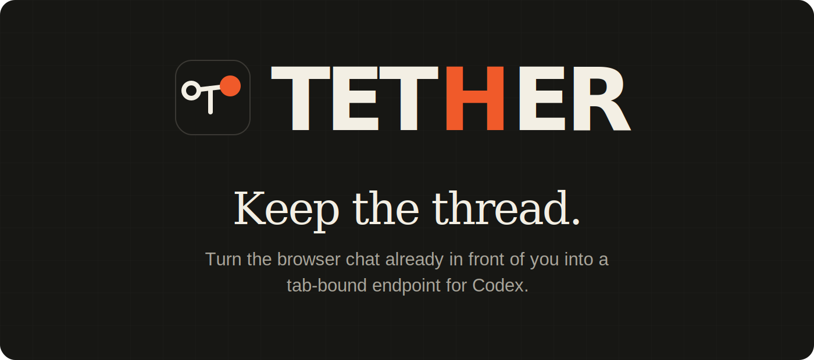
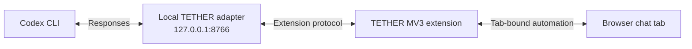

<p align="center">
  
</p>

<p align="center">
  
  
  
  
</p>

<p align="center">
  <a href="#quick-start">Quick start</a> ·
  <a href="#how-it-works">How it works</a> ·
  <a href="#using-tether">Using TETHER</a> ·
  <a href="#development">Development</a> ·
  <a href="#troubleshooting">Troubleshooting</a>
</p>

TETHER connects Codex to a browser chat that is already open, authenticated, and carrying the context you care about. One command starts a local Responses adapter and Codex; the Manifest V3 extension binds the selected provider tab, exposes it through a side panel, and protects the page from accidental interaction while automation owns the route.

It is designed for a simple idea: **keep the conversation in the browser, but let Codex use it as an endpoint.**

## Why TETHER

| Capability | What it means |
| --- | --- |
| **Keep the thread** | Work with the provider conversation already open in your browser instead of starting from an empty API session. |
| **Tab-bound ownership** | Every endpoint belongs to one concrete browser tab and keeps a stable session identity. |
| **Interaction guard** | A translucent, themed overlay blocks accidental page input while TETHER is active and releases it on deactivation. |
| **Local bridge** | The adapter listens on `127.0.0.1:8766`; no separate adapter installation or manual startup is required. |
| **Provider aware** | ChatGPT, Gemini, and Claude have built-in recognition. Other HTTPS chat surfaces can be calibrated. |
| **CLI and CROSS modes** | Use one browser endpoint for Codex or pair two provider tabs in a master/slave relay. |

## Quick start

### 1. Requirements

- Node.js 18 or newer
- npm and Git
- Chrome, Brave, or another Chromium browser with side-panel support
- An authenticated browser session for the chat provider you want to use

### 2. Install TETHER

Install directly from the repository:

```powershell
npm install --global git+https://github.com/RaphaelBlaster/tether-suite.git
```

If the repository is private, authenticate Git for GitHub before running the command.

### 3. Load the extension once

Ask the installed CLI for the exact extension directory:

```powershell
tether extension-path
```

Then:

1. Open `chrome://extensions` or `brave://extensions`.
2. Enable **Developer mode**.
3. Choose **Load unpacked**.
4. Select the directory printed by `tether extension-path`. It must be the folder containing `manifest.json`.
5. Pin TETHER if you want one-click access to the side panel.

### 4. Start the local bridge and Codex

From the project you want Codex to work in:

```powershell
tether
```

Or pass the project directory explicitly:

```powershell
tether -C "C:\path\to\project"
```

TETHER automatically starts the embedded adapter, waits for its health check, launches Codex with the local Responses provider, and stops the adapter when Codex exits.

### 5. Activate a browser endpoint

1. Open ChatGPT, Gemini, Claude, or a calibrated HTTPS chat page.
2. Click the TETHER extension icon to open its side panel for that tab.
3. Confirm that **Bridge online** is shown.
4. Select **CLI** for a single endpoint.
5. Choose **Activate as CLI endpoint**.

The active view turns orange, the endpoint becomes live, and the interaction guard appears on the owned page. Deactivate from the power control in the side panel to restore normal page interaction.

## How it works



The adapter translates Codex Responses requests into a bounded browser-turn protocol. The extension maintains tab identity, connection state, calibration profiles, and the page interaction guard. Browser automation runs only against the endpoint selected in the side panel.

### Runtime sequence

1. `tether` checks whether the local adapter is already healthy.
2. If needed, it starts the embedded adapter on port `8766`.
3. Codex launches with `tether-compact` and the TETHER Responses provider.
4. The extension registers active browser sessions with the adapter.
5. A Codex turn is correlated to the selected browser session.
6. TETHER writes the prompt, submits it, waits for a stable response, and returns the correlated result to Codex.

## Using TETHER

### CLI mode

CLI mode owns one provider tab at a time. It is the default mode and the clearest choice for normal Codex work.

### CROSS mode

CROSS mode binds two tabs:

- **MASTER** receives the primary request.
- **SLAVE** receives the master response and produces the final relayed answer.

Assign one role to each active endpoint. Duplicate roles are rejected, and both tabs remain independently identified.

### Theme and interaction guard

The side panel and protected-page card support light and dark themes. Theme changes propagate to active protected pages. While an endpoint is active, the guard blocks manual pointer, keyboard, touch, and wheel input so automation cannot be interrupted accidentally.

## Install from source

Use this path when developing TETHER itself:

```powershell
git clone https://github.com/RaphaelBlaster/tether-suite.git
cd tether-suite

npm install
npm --prefix extension install
npm run extension:build
npm install --global .
```

For development, the unpacked extension directory is:

```text
extension/dist
```

Reload TETHER in the browser extension manager and refresh provider tabs after rebuilding the content script.

## Development

Run the complete JavaScript checks:

```powershell
npm test
npm run pack:check
npm --prefix extension run lint
npm --prefix extension test
npm run extension:build
```

The current extension suite covers tab lifecycle, session identity, calibration, injection, extraction, automation, side-panel persistence, connection recovery, and rapid repeated actions.

### Repository layout

| Path | Purpose |
| --- | --- |
| `bin/tether.js` | CLI entry point. |
| `lib/launcher.js` | Starts the adapter and launches Codex with the TETHER provider. |
| `adapter/` | Local Responses adapter and browser-turn protocol. |
| `extension/src/` | React side panel, MV3 background worker, and content automation. |
| `extension/dist/` | Production extension loaded through **Load unpacked** and included in the npm package. |
| `codex-cli/` | Upstream Codex source snapshot retained for investigation and compatibility work. |

## Security and privacy notes

- The adapter binds to loopback at `127.0.0.1:8766`.
- Host access is optional and requested per selected origin.
- Extension-owned storage is restricted to trusted extension contexts.
- The interaction guard blocks user input; it is not a security sandbox.
- Chrome displays a browser-owned **“TETHER started debugging this browser”** banner while debugger-based automation is attached. This is expected security UI and cannot be hidden by the extension.
- Prompts and responses still pass through the browser provider you selected and remain subject to that provider's terms and privacy policy.

## Troubleshooting

### “The folder name is not valid” when loading the extension

Do not paste a nonexistent or truncated path into the folder picker. Run `tether extension-path`, navigate to that directory, and select the folder containing `manifest.json`.

### Bridge offline

Start `tether` in a terminal. If it remains offline, check whether another process is using port `8766`, then restart the CLI and reopen the side panel.

### The side panel or protected card looks stale after an update

Reload TETHER from `chrome://extensions`, then refresh the provider tab once so Chrome injects the current content script.

### A provider page cannot activate

Grant access for the current origin. Built-in providers can activate directly; other HTTPS chat pages require calibration of the composer, send control, and response structure.

### The page is protected but the CLI has closed

Return to the owned tab and use the side-panel power control to deactivate it. TETHER preserves tab ownership during short bridge interruptions so an unrelated tab cannot silently take over the session.

## Contributing

1. Create a focused branch.
2. Keep browser-session identity and tab ownership explicit.
3. Add or update tests for lifecycle or protocol changes.
4. Rebuild `extension/dist` when extension source changes.
5. Run the complete checks above before opening a pull request.

Avoid mixing visual redesigns with automation-protocol changes unless the behavior genuinely requires both; the UI should remain replaceable without weakening the working bridge.

## License

This repository does not currently include a license. Add a `LICENSE` file before public release or accepting outside redistribution. The repository owner should explicitly choose the intended terms rather than inheriting a license from a reference project.
