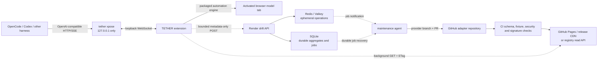

# TETHER XPOSE and selector-control-plane plan

## Non-negotiable boundary

TETHER has two independent planes:

1. **XPOSE data plane:** local-only model traffic. It binds to
   `127.0.0.1`, and OpenCode or another harness connects directly to that
   loopback endpoint. Prompts and responses never pass through Render, Redis,
   GitHub or the TETHER website.
2. **Selector control plane:** asynchronous HTTPS distribution of reviewed
   declarative provider manifests plus privacy-safe drift reporting. It is
   never on the model-request critical path.

CLI, CROSS and XPOSE are separate product modes. XPOSE does not depend on CROSS,
and CROSS does not relay CLI or XPOSE requests.

## Target architecture



## XPOSE contract

### Command and lifecycle

- `tether` retains its current CLI-launching behavior.
- `tether xpose` starts only the local compatibility server and prints:
  - Base URL, for example `http://127.0.0.1:8766/v1`.
  - A generated bearer token for the harness API-key field.
  - Available model IDs and the selected TETHER browser session.
- Closing the process closes the exposed endpoint.
- The server never binds to `0.0.0.0` in XPOSE mode.

### Compatibility surface

Implement in this order:

1. `GET /v1/models`
2. `POST /v1/responses`, streaming and non-streaming
3. `POST /v1/chat/completions`, streaming and non-streaming
4. Stable error envelopes, cancellation and disconnect propagation

The extension already connects outward to the loopback WebSocket, which avoids
asking a Manifest V3 extension to listen on a TCP port.

### Local security

- Require `Authorization: Bearer <random-token>` on every harness endpoint.
- Compare tokens in constant time.
- Accept traffic only when the remote address is loopback.
- Validate `Host` to mitigate DNS rebinding.
- Do not grant browser CORS access to the harness API.
- Bound request bodies and concurrent turns.
- Add an explicit extension-pairing handshake before treating an extension
  WebSocket as trusted. Bearer authentication and extension pairing use
  different secrets.
- Never write prompts, responses or tokens to default logs.

## Provider manifest publication

`provider-adapters/` is the only durable manifest truth. Every manifest:

- is data-only JSON;
- is restricted to an exact HTTPS origin;
- has a monotonically increasing adapter version;
- contains bounded selectors and structural fingerprints only;
- contains no JavaScript, URLs to execute, commands, event handlers or code;
- is covered by the index hash and a production Ed25519 index signature.

The maintenance agent creates a provider branch and pull request. CI validates
the candidate and publishes only after review. The extension uses HTTPS, never
Git commands or GitHub write APIs.

## Extension refresh state machine

1. Start with the current accepted cache entry or packaged adapter.
2. Refresh the registry index in the background with `If-None-Match`.
3. On `304`, keep the current entry.
4. Download only a newer manifest for the active origin.
5. Enforce the response-size limit before parsing.
6. Verify the signed index and manifest SHA-256.
7. Run the extension's strict schema and exact-origin validation.
8. Dry-test composer and Send selectors against the page without acting.
9. Save the candidate and previous active version in
   `chrome.storage.local`.
10. Promote the candidate only after dry validation.
11. On failure, mark that version rejected for the navigation, restore the
    last-known-good adapter and retain the packaged fallback.
12. Retry at most once after a runtime selector failure, then apply cooldown
    and exponential backoff.

## State ownership

| State | Owner | Durability |
|---|---|---|
| Reviewed provider manifest history | GitHub | Durable and auditable |
| Published index and bundle | Static CDN / registry service | Rebuildable from Git |
| Accepted and last-known-good adapters | Extension local storage | Durable per installation |
| Drift aggregates | SQLite | Durable on the Render disk |
| Maintenance job records | SQLite | Durable on the Render disk |
| Rate limits and deduplication | Redis / Valkey | Intentionally ephemeral |
| Verified manifest byte cache | Redis / Valkey | Intentionally ephemeral |
| Worker wake-up queue | Redis / Valkey | Ephemeral notification; SQLite recovers jobs |
| Prompts and model responses | Local XPOSE path only | Not stored by registry infrastructure |

## Drift API

`POST /v1/drift-reports` accepts exactly:

```json
{
  "origin": "https://tinker.thinkingmachines.ai",
  "adapterVersion": 1,
  "extensionVersion": "0.1.0",
  "errorCode": "assistant_selector_missing"
}
```

It rejects unknown fields, page text, DOM, prompts, responses, cookies,
headers, user IDs and selector dumps. Redis rate-limits and deduplicates the
report. SQLite increments the durable aggregate. Once the configured threshold
is reached, SQLite creates one open maintenance job and Redis wakes a worker.

## Render deployment boundary

Connect the complete TETHER repository to Render so the shared validator is
available during the build, but run/publish only these paths:

- `registry-server/`
- `provider-adapters/`
- `render.yaml`

Do **not** host the XPOSE process, browser adapter, prompt path or response path
on Render. `render.yaml` provisions:

- one Node web service;
- one Redis-compatible Render Key Value instance with persistence disabled;
- one 1 GB persistent disk mounted at `/var/data` for SQLite.

The persistent disk makes the web service single-instance. That is an
intentional MVP constraint. When horizontal scaling is needed, migrate the
SQLite tables to Postgres while keeping Git as the manifest source of truth.

## Delivery sequence and gates

### Phase 1 — selector service

- Git manifest layout, checksums and optional CI signature.
- Redis operational store plus local-memory fallback.
- SQLite migration, aggregate and job outbox.
- ETag-enabled registry reads and bounded drift writes.
- Unit and HTTP integration tests.
- Render Blueprint and deployment documentation.

Gate: registry tests pass without Redis; production configuration reports Redis
as ready; restart preserves SQLite data.

### Phase 2 — extension consumer

- Configure the approved production registry origin.
- Add its exact host permission.
- Verify signature and checksum.
- Wire refresh, drift reporting, cooldown and rejected-version memory.
- Test offline, corrupt, stale, wrong-origin and rollback cases.

Gate: no registry outage can prevent use of a packaged or last-known-good
adapter.

### Phase 3 — XPOSE

- Extract a server-only launcher from the existing local adapter.
- Add token authentication, `/v1/models` and Chat Completions compatibility.
- Add `tether xpose` without changing plain `tether`.
- Add cancellation, streaming and multi-harness contract tests.

Gate: an OpenCode custom provider completes a real turn while packet inspection
shows that TETHER infrastructure receives no prompt or response bytes.

### Phase 4 — maintenance automation and website

- Registry explorer, provider health and public architecture documentation.
- Authenticated maintenance-worker endpoints or queue consumer.
- Controlled-browser discovery, fixture capture and provider-specific PRs.
- CI signing and static publication.

Gate: the agent can propose a manifest PR but cannot publish directly to the
reviewed production channel.
