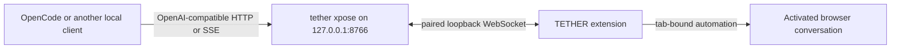

# TETHER XposE

XposE exposes one activated TETHER browser conversation as a local
OpenAI-compatible endpoint. The HTTP server runs in the TETHER local companion;
the browser extension continues to connect outward over its loopback WebSocket.

## Start

Stop a running plain `tether` process first because CLI and XposE intentionally
share loopback port `8766`.

Start the XposE companion:

```powershell
tether xpose
```

For a source checkout:

```powershell
node .\bin\tether.js xpose
```

Then select **XposE** under Transport in the side panel and activate exactly
one browser endpoint. The companion can start before activation; it will wait
for the XposE session.

The command prints:

- `http://127.0.0.1:8766/v1`
- model ID `tether-browser`
- a persistent local bearer token to use as the client's API key
- the selected browser session, or a waiting status

Once the XposE companion connects, the active side panel shows the same base
URL and model in a local endpoint card. The URL can be copied directly from
that card. The API key remains local, is reused across XposE restarts, and is
printed only in the terminal.

The bearer token is created once at `~/.tether/state/xpose-api-token` and reused
across restarts, so local clients need to be configured only once. Closing the
process still closes the endpoint. Rotate a leaked token explicitly:

```powershell
tether xpose --rotate-key
```

For a source checkout:

```powershell
node .\bin\tether.js xpose --rotate-key
```

Rotating the key requires updating every configured local client.

## API

Every `/v1` request requires:

```http
Authorization: Bearer <token printed by tether xpose>
```

Supported routes:

- `GET /v1/models`
- `POST /v1/responses`
- `POST /v1/chat/completions`

Both POST routes accept `stream: false` and `stream: true`. Chat Completions
supports text messages, function tools, tool calls, and tool-result messages.
Responses accepts text or Responses-style input arrays and function tools.
Usage fields are reported as zero because browser providers do not expose
reliable API token counts.

Example:

```powershell
$headers = @{ Authorization = "Bearer <TOKEN>" }
$body = @{
  model = "tether-browser"
  messages = @(@{ role = "user"; content = "Summarize this conversation." })
} | ConvertTo-Json -Depth 8

Invoke-RestMethod `
  -Method Post `
  -Uri "http://127.0.0.1:8766/v1/chat/completions" `
  -Headers $headers `
  -ContentType "application/json" `
  -Body $body
```

Configure OpenCode or another custom-provider client with the printed base URL,
token, and `tether-browser` model ID.

## Data flow



XposE does not call the hosted registry, Render, Redis, GitHub, or the TETHER
website with prompts or model responses. The selected browser provider still
receives the conversation through its normal website.

## Security model

- The server binds only to `127.0.0.1`.
- Requests are rejected unless their remote address is loopback.
- `Host` is limited to `127.0.0.1`, `::1`, or `localhost`.
- Browser CORS access is not granted.
- The local bearer token is generated from 256 random bits, stored with
  owner-only file permissions where the operating system supports them, and
  compared in constant time.
- The extension uses a separate persistent 256-bit pairing secret. On first
  XposE connection, the local companion trusts the Chrome-extension-origin
  installation and stores only the secret's SHA-256 hash.
- Request bodies are limited to 2 MiB and only one browser turn runs at once.
- XposE does not enable the adapter request capture file.
- Client disconnects send a correlated cancellation to the extension.

The first-pairing step is trust-on-first-use. A hostile local process able to
race the real extension on the first ever XposE start remains a residual local
threat; later starts require the stored installation identity and pairing
proof.

## Streaming behavior

Browser pages expose a stable completed response, not provider token deltas.
XposE therefore waits for the stable browser answer and then emits valid SSE
framing as a coarse content or tool-call chunk followed by completion. It does
not simulate token timing.

## Lifecycle and routing

XposE accepts exactly one endpoint explicitly activated in XposE mode. Zero endpoints return
`no_active_session`; multiple endpoints return `ambiguous_session`; CROSS
registrations return `cross_not_supported`, and a CLI-mode endpoint returns
`xpose_mode_required`. Plain `tether` retains its existing
Codex-launching behavior and does not accept XposE's authenticated API contract.
